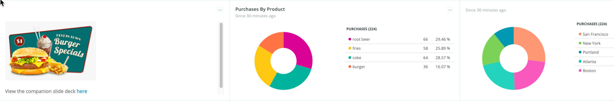
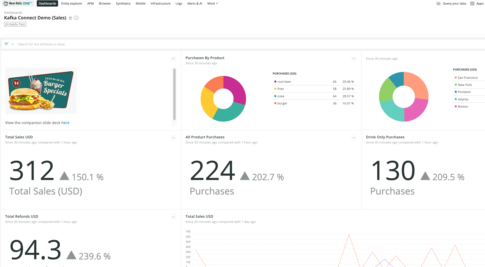

# kafka-connect-demo




### Prerequisites and assumptions

- On your dev system you'll need A Kafka Broker Installation.  I installed Kafka at `/opt/kafka_2.13-3.8.0/` and this tutorial assumes such.  To run Kafka and connect I used an AWS `t2.large` with 8G memory running RHEL.  You may be able to run a smaller instance, but Kafka likes to have at least 6G of memory allocated.

- I have provided convenience systemd service files for Kafka and Zookeeper as the apache ditribution doesn't set these up for you.  It is possible to try a [cloud hosted Kafka instance](https://www.confluent.io/confluent-cloud) with a company like Confluent but I did not do that.

- For configuring the Connect worker and connector I use `.properties` files rather than a REST API.  I think the.properties files are clearer to read for demonstration purposes and easier to version control

### Section 1: Install and Setup Kafka Broker

1. [Install Kafka](https://kafka.apache.org/quickstart) 
2. Make sure Zookeeper and Kafka are running refer to the `kafka.service` and `zookeeper.service` systemd files for the commands.  If you wish to run using systemd copy the two provided services files to `/usr/lib/systemd/system` and run `sudo service zookeeper start` followed by `sudo service kafka start`
3. Create the demo topic with this command: `/opt/kafka_2.13-3.8.0/bin/kafka-topics.sh --create --topic sales --bootstrap-server localhost:9092`
4. Just to make sure Kakfa is running as we expect and the topic has been created, in a *dedicated terminal* run the command `/opt/kafka_2.13-3.8.0/bin/kafka-console-consumer.sh --topic sales --bootstrap-server localhost:9092`.  Any time a message goes into the `sales` topic it will be echoed to this terminal as it is a Kafka consumer.  Note that the Kafka Connect telemetry sink we start in the next section will also be a separate Kafka consumer.

### Section 2: Install and Setup Kafka Connect
1. The basic kafka connect framework comes with the Kafka installation we did in Section 1.  Now we need to install the New Relic specific telemetry connector `sinks`.   You can use the [Confluent Hub CLI to install Kafka Connect New Relic](https://www.confluent.io/hub/newrelic/newrelic-kafka-connector).   You can also just download the file and put it where you want it.  At the last revision this was the downloaded file: `newrelic-newrelic-kafka-connector-2.3.3.zip`.  For this demo install the connectors to `/opt/connectors/`.   The Confluent CLI will create a subfolder with the name `newrelic-newrelic-kafka-connector`.  If you run `ls -l` on `/opt/connectors/newrelic-newrelic-kafka-connector/` you'll see:

```
drwxr-xr-x. 2 root root   26 Sep 24 17:20 assets
drwxr-xr-x. 2 root root   23 Sep 24 17:20 doc
drwxr-xr-x. 2 root root  146 Sep 24 17:20 etc
drwxr-xr-x. 2 root root 4096 Apr 11 21:48 lib
-rw-r--r--. 1 root root 1426 Apr 11 21:48 manifest.json
```

Run `ls -l` on the lib subfolder and you'll see unerlying Java code:

```
-rw-r--r--. 1 root root   17536 Apr 11 21:48 annotations-13.0.jar
-rw-r--r--. 1 root root 1670468 Apr 11 21:48 kotlin-stdlib-1.8.21.jar
-rw-r--r--. 1 root root  225141 Apr 11 21:48 kotlin-stdlib-common-1.9.10.jar
-rw-r--r--. 1 root root     963 Apr 11 21:48 kotlin-stdlib-jdk7-1.8.21.jar
-rw-r--r--. 1 root root     968 Apr 11 21:48 kotlin-stdlib-jdk8-1.8.21.jar
-rw-r--r--. 1 root root   34161 Apr 11 21:48 newrelic-kafka-connector-2.3.3.jar
-rw-r--r--. 1 root root  789531 Apr 11 21:48 okhttp-4.12.0.jar
-rw-r--r--. 1 root root   25744 Apr 11 21:48 okio-3.6.0.jar
-rw-r--r--. 1 root root  359580 Apr 11 21:48 okio-jvm-3.6.0.jar
-rw-r--r--. 1 root root   41125 Apr 11 21:48 slf4j-api-1.7.36.jar
-rw-r--r--. 1 root root  101968 Apr 11 21:48 telemetry-core-0.16.0.jar
-rw-r--r--. 1 root root    3433 Apr 11 21:48 telemetry-http-okhttp-0.16.0.jar
```

2. Now that we've confirmed that Kafka Connect New Relic is installed lets copy our file `nrevents.properties` to `/opt/connectors/newrelic-newrelic-kafka-connector/`.  The config file looks like this (but you'll need to provide a valid insights insert key):

```
name=sales-events-connector
connector.class=com.newrelic.telemetry.events.TelemetryEventsSinkConnector
value.converter=com.newrelic.telemetry.events.EventsConverter
topics=sales
api.key=[INSIGHTS INSERT KEY]
errors.log.enable = true
errors.deadletterqueue.topic.name = nrevents_deadletter
errors.retry.delay.max.ms = 10000
errors.tolerance = all
tasks.max = 1
```

3. In order to run the connector we'll need whats called a `worker`.  Kafka comes with a `standalone worker` that is good for dev environments.  Make a backup of `/opt/kafka_2.13-3.8.0/config/connect-standalone.properties` and replace it with our version of `connect-standalone.properties`.  It will look like this:

```
bootstrap.servers=localhost:9092
key.converter=org.apache.kafka.connect.json.JsonConverter
value.converter=org.apache.kafka.connect.json.JsonConverter
key.converter.schemas.enable=true
value.converter.schemas.enable=true
offset.storage.file.filename=/tmp/connect.offsets
offset.flush.interval.ms=60000
plugin.path=/opt/connectors/
```

4. We are now ready to start the Kafka Connect standalone worker.  In a *separate terminal* run the following commands:

```
sudo su
cd /opt/kafka_2.13-2.6.0
./bin/connect-standalone.sh ./config/connect-standalone.properties /opt/connectors/newrelic-newrelic-kafka-connector/nr_events.properties
```

*NOTE* If you wish to process the data as a New Relic log replace `nr_events.properties` with `nr_logs.properties`

If successful you'll see a lot of verbose output, but at the end you'll see something like (but not exactly):

```
{'eventType': 'Return', 'customer': 13382, 'amount': 1.25, 'product': 'fries', 'location': 'Boston', 'pipeline': 'kafka-connect', 'timestamp': 1727275656, 'message': 'Customer 13382 purchased fries for $1.25'}
{'eventType': 'Purchase', 'customer': 12184, 'amount': 1.5, 'product': 'root beer', 'location': 'Boston', 'pipeline': 'kafka-connect', 'timestamp': 1727275657, 'message': 'Customer 12184 purchased root beer for $1.5'}

<kafka.producer.future.FutureRecordMetadata object at 0x7f3caf5217f0>
<kafka.producer.future.FutureRecordMetadata object at 0x7f3caf5212b0>
```

An additional way to determine that everything is a-okay is to run the command `curl -s "http://localhost:8083/connectors?expand=info&expand=status"`

### Section 3: Send some simulated events and visualize them

1. In order to send the metrics to New Relic we will use a set of python scripts named `generate_events_direct.py` and `generate_events_kafka.py` respectively.  The scripts are nearly identical.  Both send some simulated fast food purchase data but one sends directly to the NR events API.  The kafka version sends events to two different topics, `nr_events` and `nr_logs` which you can use kafka sink connectors to consume.  Also each script sends an attribute named `pipeline` which will have either the value `direct` or `kafka-connect`.

- Cd into the folder `event_simulator`
- Run `sudo yum install virtualenv`
- Setup your virualenvironment using the provided `requirements.txt` file and command `virtualenv ./venv`
- Active your virutual environment with `. ./venv/bin/activate`
- Run the direct sender with `python generate_events_direct.py`  You'll see something like this:

    ```
    {'eventType': 'Purchase', 'customer': 100, 'amount': 1.5, 'product': 'root beer', 'location': 'Atlanta', 'pipeline': 'direct', 'timestamp': 1605972774}
    {'eventType': 'Purchase', 'customer': 22, 'amount': 1.5, 'product': 'coke', 'location': 'Atlanta', 'pipeline': 'direct', 'timestamp': 1605972775}
    {'eventType': 'Purchase', 'customer': 7, 'amount': 1.5, 'product': 'root beer', 'location': 'Portland', 'pipeline': 'direct', 'timestamp': 1605972776}
    200
    {"success":true, "uuid":"7e547135-0021-b000-0000-0175eb6fd8b8"}
    ```

    The 200 confirms that New Relic received the data and you will be able to see `Purchase` events on the backend.

- Now run the kafka sender with `python generate_events_kafka.py`.  You'll see very similar output to the previous command except in stead of a 200 and a UUID from the New Relic API you'll get something like this `<kafka.producer.future.FutureRecordMetadata object at 0x7f0fa5bde588>` which is Kafka confirming our message was received.  In addition the console consumer we setup earlier will echo the event object (since it's consuming from the `nr_events` or `nr_logs` topic).  Most iportantly your Kafka Connect standalone worker will output something like this:

    ```
    [2020-11-21 15:35:23,456] INFO Response from new relic Response{statusCode=200, statusMessage='OK', body='{"success":true, "uuid":"2adb36fa-0021-b000-0000-0175eb721427"}'} (com.newrelic.telemetry.events.TelemetryEventsSinkTask:126)
    ```

That's the worker confirming that it consumed the message from Kafka and successfully sent the message to the New Relic event API!

2. On the backend we'll want to setup a dashboard or simply setup the following queries in the New Relic data explorere: 

    `SELECT count(*) from Purchase facet product, location, pipeline`

    or 

    `SELECT count(*) from Log where pipeline = 'kafka-connect' facet product, location`

### Example Dashboard




